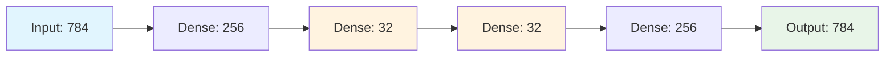
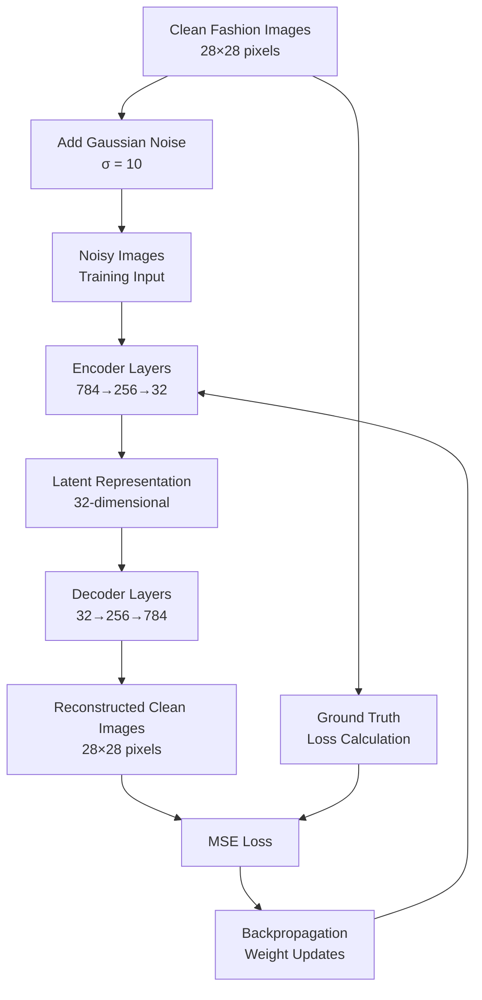

# Image Denoiser using Neural Networks

A deep learning implementation for removing noise from fashion images using a custom autoencoder architecture built with TensorFlow v1.

## Overview

This project implements an image denoising system that takes noisy fashion images and reconstructs clean versions using a neural network trained on the Fashion-MNIST dataset. The system artificially introduces Gaussian noise to clean images during training and learns to map noisy inputs back to their original clean state.

## Technical Architecture

### Network Structure

The denoising model employs a symmetric autoencoder architecture with the following configuration:

```
Input Layer:     784 neurons (28×28 flattened images)
Hidden Layer 1:  256 neurons (compression)
Hidden Layer 2:  32 neurons  (bottleneck/latent space)
Hidden Layer 3:  32 neurons  (expansion start)
Hidden Layer 4:  256 neurons (reconstruction)
Output Layer:    784 neurons (28×28 reconstructed images)
```

#### Architecture Diagram



### Key Components

#### 1. Data Preprocessing
- **Dataset**: Fashion-MNIST training set (60,000 samples)
- **Noise Generation**: Additive Gaussian noise with σ=10
  ```python
  X_train_noisy = X_train + 10 * np.random.normal(0, 1, size=X_train.shape)
  ```
- **Normalization**: Pixel values scaled to [0, 255] range

#### 2. Network Architecture Details

**Activation Functions**:
- Hidden layers: Sigmoid activation for smooth gradient flow
- Output layer: Linear activation for pixel value reconstruction

**Weight Initialization**:
- Random normal initialization for all weight matrices
- Separate bias vectors for each layer

**Computational Graph**:
```python
z1 = tf.add(tf.matmul(X, Weight_NN["W1"]), Bias_NN["B1"])
z1_out = tf.nn.sigmoid(z1)
# ... similar pattern for subsequent layers
NN_output = z5  # Final output (linear activation)
```

#### 3. Training Configuration

**Hyperparameters**:
- Learning Rate: 0.1
- Epochs: 100
- Batch Size: 100
- Optimizer: Adagrad

**Loss Function**: Mean Squared Error (MSE)
```python
computed_loss = tf.reduce_mean(tf.square(NN_output - Y))
```

### Denoising Process Flow



### Mathematical Foundation

#### Noise Model
The system assumes additive white Gaussian noise:
```
y = x + n
```
Where:
- `y`: noisy observation
- `x`: clean image
- `n ~ N(0, σ²I)`: Gaussian noise

#### Reconstruction Objective
The network learns the inverse mapping `f: y → x̂` by minimizing:
```
L = (1/N) Σ ||x - f(y)||²
```

### Training Results Analysis

The training demonstrates convergence from an initial loss of ~3688 to ~1945 over 100 epochs, indicating the network successfully learned to denoise fashion images. The symmetric architecture with a 32-neuron bottleneck forces the model to learn compact representations while maintaining reconstruction quality.

### Performance Characteristics

**Strengths**:
- Effective noise removal for Gaussian noise corruption
- Compact latent representation (32-dimensional bottleneck)
- Fast inference due to simple feedforward architecture

**Limitations**:
- Trained specifically for Fashion-MNIST domain
- Fixed noise level (σ=10) optimization
- TensorFlow v1 implementation (legacy)

### Technical Implementation Notes

The code utilizes TensorFlow v1's computational graph paradigm with explicit session management. The architecture design follows classical autoencoder principles with symmetric encoder-decoder structure, making it suitable for understanding fundamental denoising concepts while maintaining computational efficiency.

## Model Visualization

The final visualization shows three rows:
1. **Original Images**: Clean fashion items from test set
2. **Noisy Images**: Same items with added Gaussian noise
3. **Denoised Output**: Network reconstruction results

This comparison demonstrates the model's capability to recover underlying image structure despite significant noise corruption.
